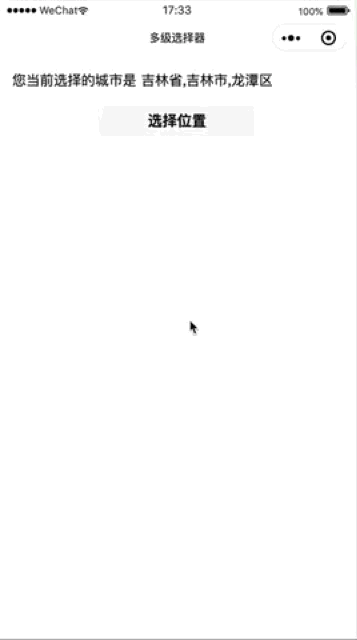

# mp-Cascader | 多级级联器 [微信小程序]

> 项目需要构建省市区级联器，没有找到相关的组件库有类似的。于是就手撸了一个。简单测了一下，不能保证没有bug，暂未商用，近期会持续优化。需要的朋友可以关注一下，欢迎对代码进行审查修改。
>

> 理论上支持多级不同深度的联动选择 

## 效果



## 说明

* /demos/city

使用全国省市区信息，演示省市区三级联动选择器

中国行政区数据来源 ： https://github.com/dwqs/area-data 

* /components/cascader

多级联动组件

## 使用

* 引入组件

拷贝/components/cascader 到项目中

在需要使用的页面内引入

```
 "usingComponents": {
    "cascader": "/components/cascader/cascader"
  }
``` 

* 使用组件

```
 <cascader></cascader>
```

## api

### props

 | 属性 | 类型 | 说明 |
| height | Number | 级联器高度，最小值300，默认500，单位rpx |
| placeholder | String | 占位提示符 |
| value | [ Number, String, Array ]  | 初始化选中值， 单级级联时可传递 Number、String 。 多级级联请传入 Array |
| options | Array | 待选项，格式如下 |

#### options格式

 | 属性 | 说明 |
 | label | 显示在选择器上的文本 |
 | value | 对应的值，唯一标识 |
 | children | 子级元素，集合数组。 格式相同 |

```
[{
  "label":"江苏省",
  "value":"10001",
  "children":[{
    "label":"南京市",
    "value":"100011",
    "children": ...
  }
  ...
  ]

...

```


### Events

 | 事件名 | 说明 | 回调参数 |
| confirm | 选择 | `Event.detail : Array` |
| cancel | 取消 | -- |
| error | 组件内部错误  | `Event.detail : String`  |

